# MentorHub Architecture

## System Overview

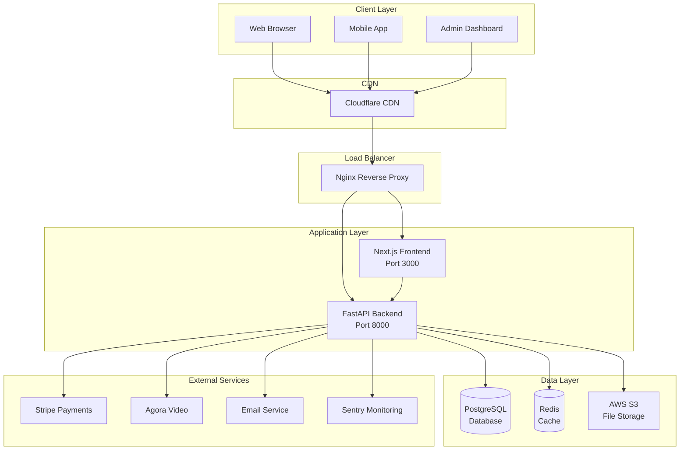

---

## Application Flow

### User Authentication Flow

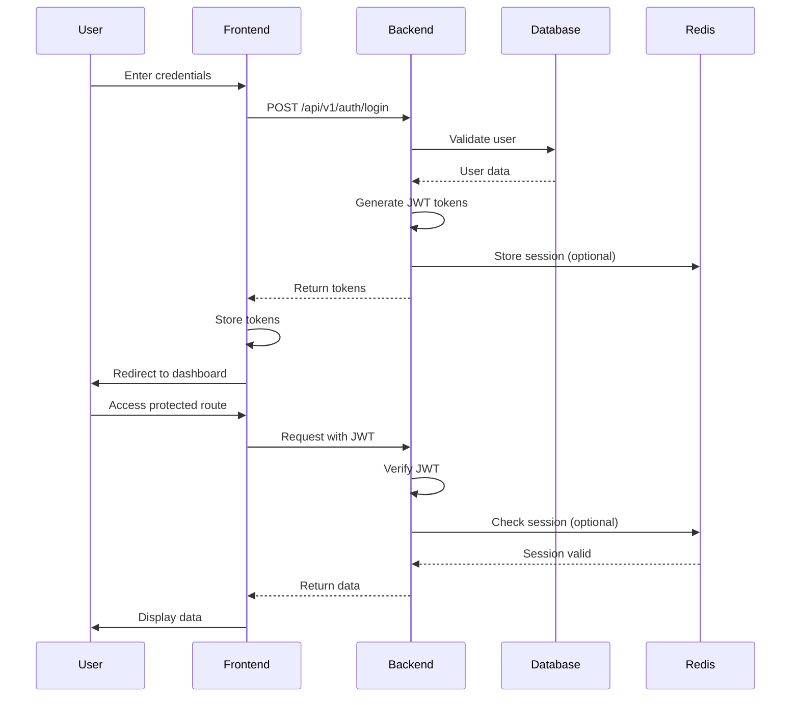

---

## Database Schema

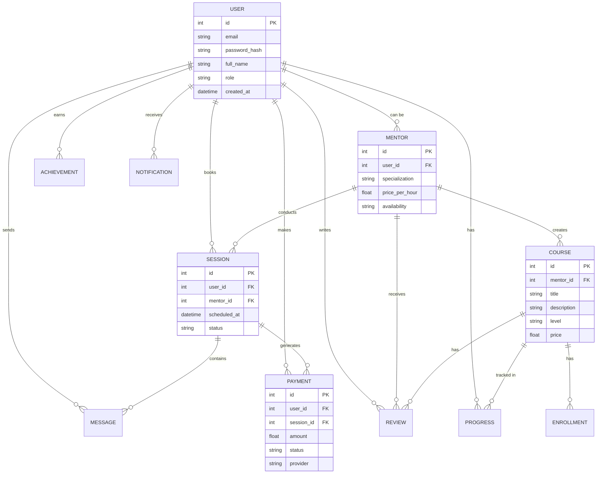

---

## Component Architecture

### Frontend Architecture

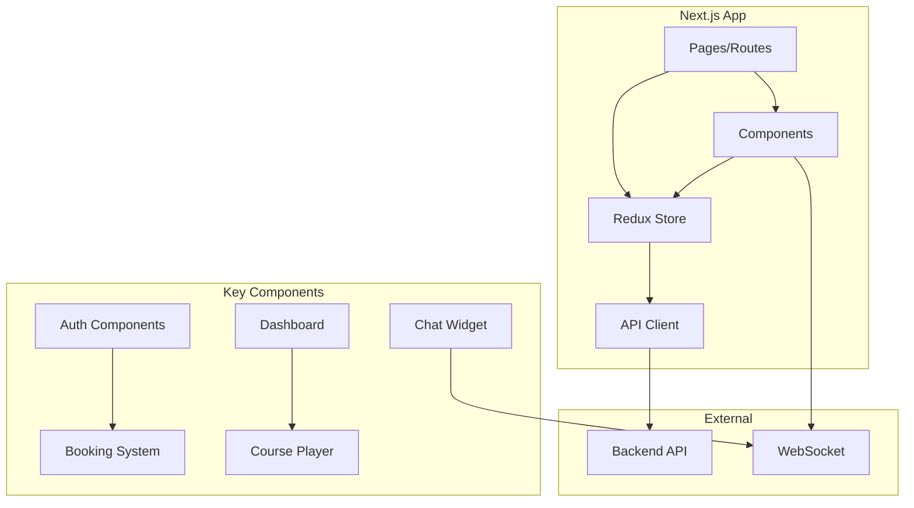

### Backend Architecture

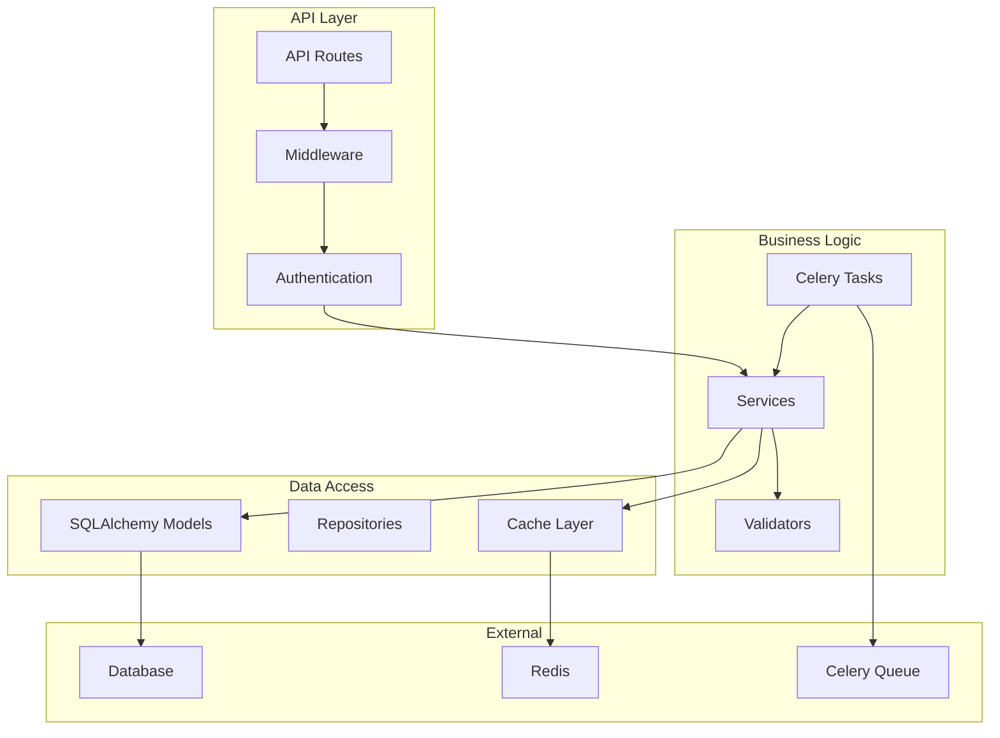

---

## Deployment Architecture

### Render Cloud Platform

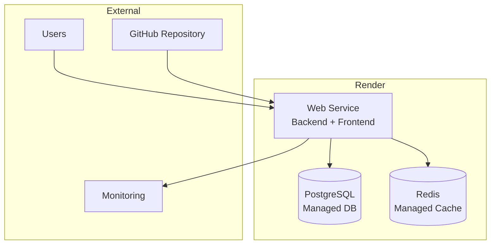

### Docker Compose (Local/Production)

```mermaid
graph TB
    subgraph Docker Containers
        Nginx[Nginx<br/>:80/:443]
        Frontend[Frontend<br/>:3000]
        Backend[Backend<br/>:8000]
        DB[(PostgreSQL<br/>:5432)]
        Cache[(Redis<br/>:6379]
        Worker[Celery Worker]
    end

    Nginx --> Frontend
    Nginx --> Backend
    Frontend --> Backend
    Backend --> DB
    Backend --> Cache
    Worker --> Backend
    Worker --> DB
    Worker --> Cache
```

---

## Security Architecture

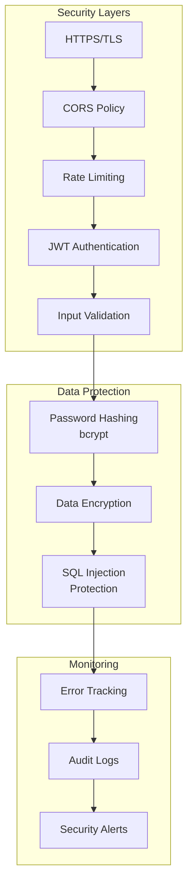

---

## Data Flow

### Booking Session Flow

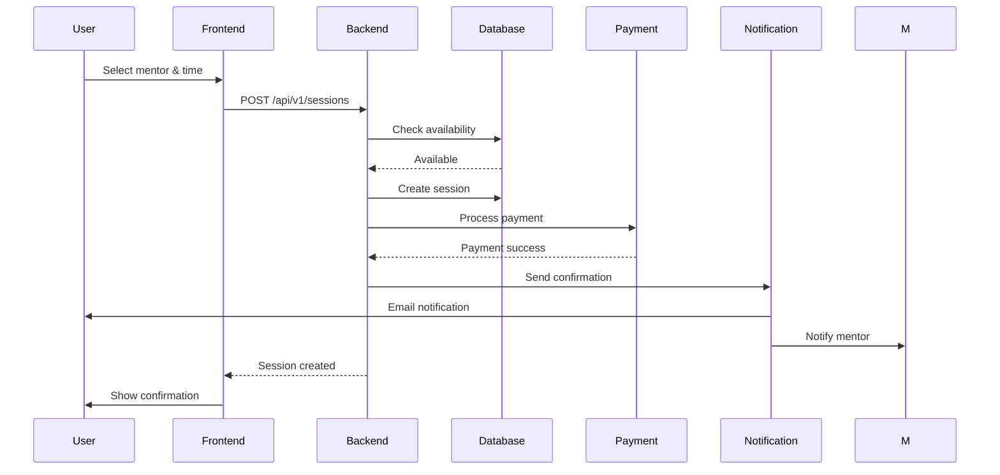

---

## Monitoring & Observability

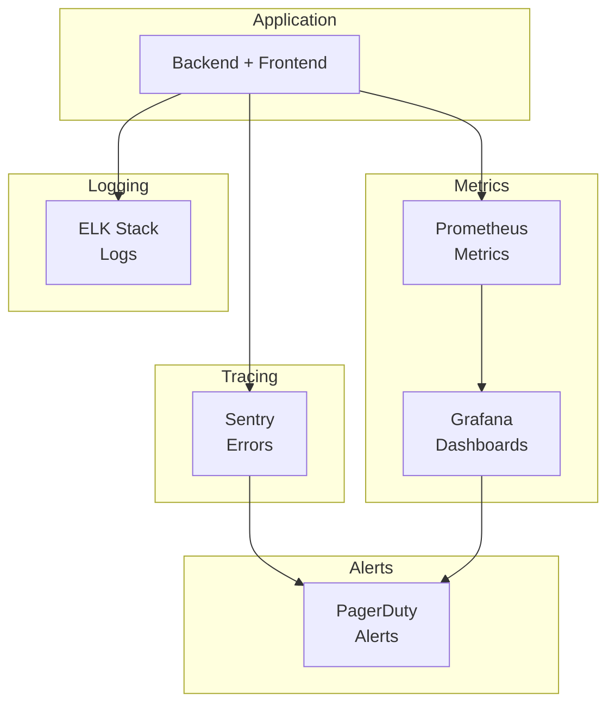

---

## Technology Stack

| Layer | Technology | Purpose |
|-------|-----------|---------|
| **Frontend** | Next.js 14 | React framework |
| **State** | Redux Toolkit | State management |
| **Data Fetching** | TanStack Query | API caching |
| **Backend** | FastAPI | Python API framework |
| **Database** | PostgreSQL 16 | Primary database |
| **Cache** | Redis 7 | Caching & sessions |
| **Queue** | Celery | Background tasks |
| **Auth** | JWT | Token-based auth |
| **Payments** | Stripe | Payment processing |
| **Video** | Agora | Video calls |
| **Monitoring** | Sentry + Prometheus | Error tracking & metrics |
| **Deployment** | Render | Cloud platform |

---

## Scalability Considerations

### Current Architecture
- Single instance deployment
- Vertical scaling (Render plans)
- Database connection pooling
- Redis caching

### Future Scaling
- Horizontal scaling (multiple instances)
- Load balancing
- Database read replicas
- CDN for static assets
- Microservices architecture
- Kubernetes orchestration

---

## Disaster Recovery

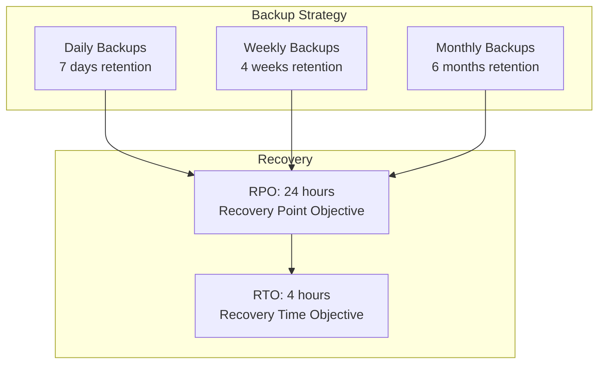

---

## API Gateway Pattern

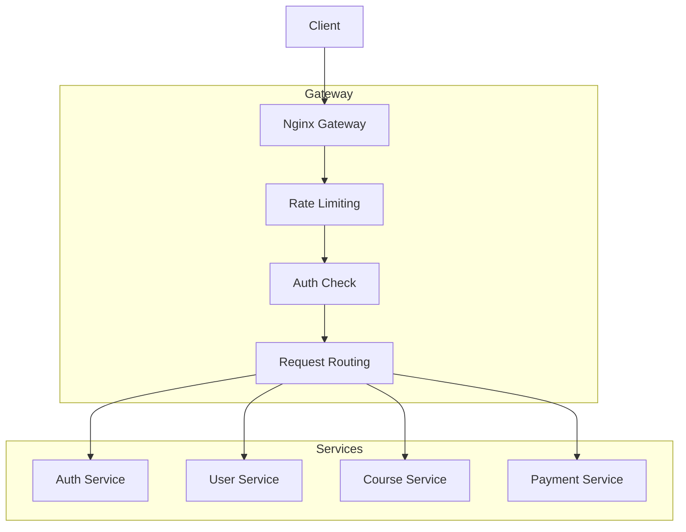

---

**Last Updated:** 2026-03-10
**Version:** 1.0.0
